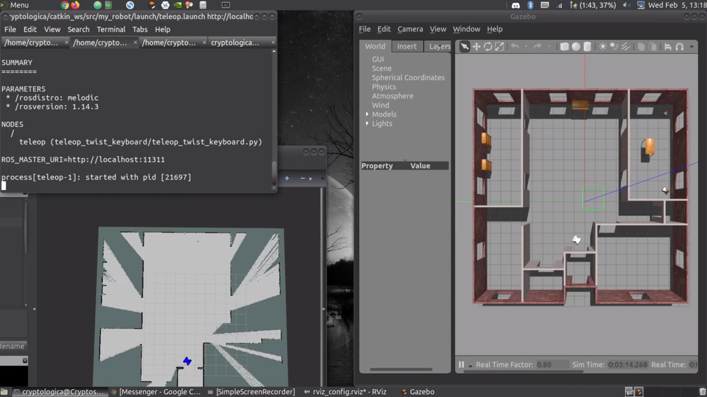

# RSD_003_WhereAmI
This repo is my submission to Udacity's Robotic Software Developer Project 003, entitled "Where Am I".

In this project, we use Adaptive Monte Carlo Localization (AMCL), RTAB Mapping (Real-Time Appearance-Based Mapping), and the TeleOp Twist Keyboard to localize our robot within our environment via an environment map created by [PGM Map Creator](https://github.com/udacity/pgm_map_creator).

The project must adhere to the [Project Rubric](https://review.udacity.com/#!/rubrics/2351/view)

 

